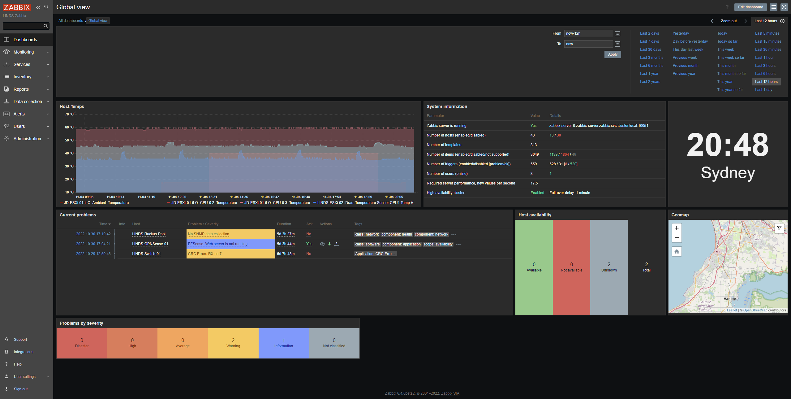

# Introduction

The best way to have visbility on what is going on in your homelab is to have monitoring over everything from Networking, Storage, and Compute hosts. To do this, I have decided to use Zabbix in HA on my Kubernetes cluster, while integrating it with my PostgreSQL HA cluster to ensure ultimate uptime of my monitoring solution.

## Kubernetes

To move this to Kubernetes, ideally we would want a PostgreSQL cluster to store everything in. We can achieve this by using a PostgreSQL operator in Kubernetes, which automates provisioning StatefulSets of databases, which automates the High Availability by switching the Kubernetes service to the master node.

1. PostgreSQL HA cluster using [Zalando PostgreSQL Operator](https://github.com/zalando/postgres-operator)
2. Zabbix Server in HA with [LINDS-Kubernetes/zabbix](https://github.com/Jayden-Lind/LINDS-Kubernetes/tree/master/zabbix)
3. TrueNAS Host to host the PostgreSQL data.

### Screenshot

